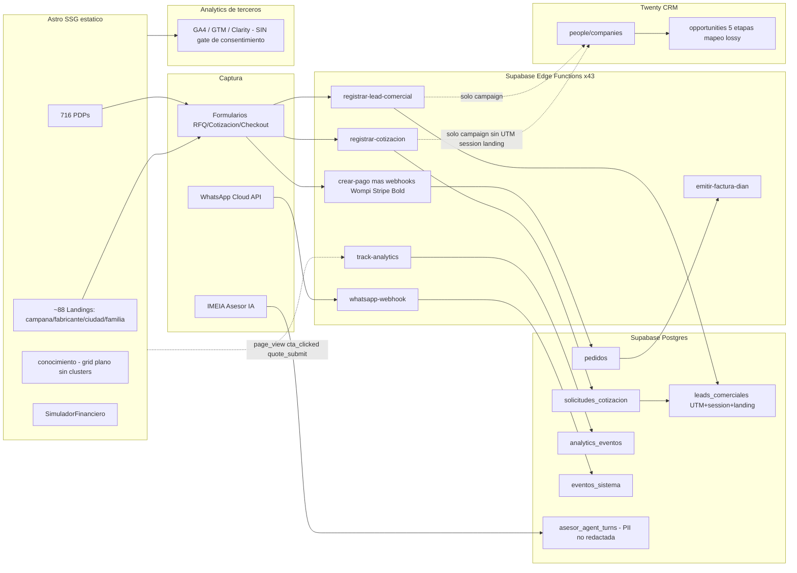
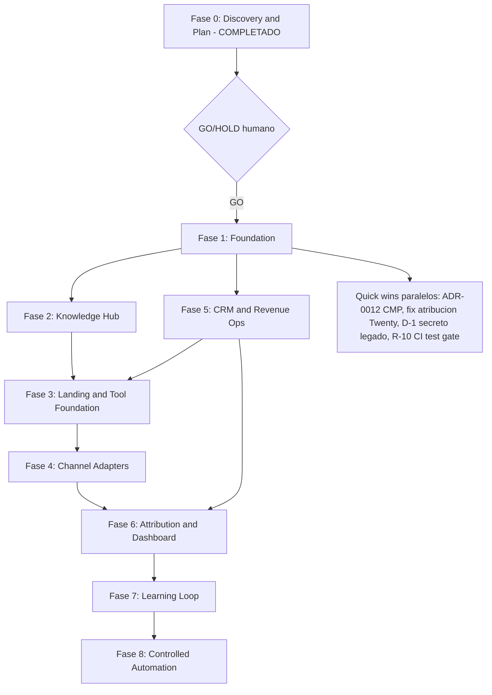

# I-ME Growth Intelligence & Knowledge Engine — IMPLEMENTATION PLAN

**Fase:** 0 — Discovery & Plan
**Estado:** Completado, pendiente decisión GO/HOLD humana antes de Fase 1
**Fecha:** 2026-09-22
**Autor:** Claude Orchestrator (con 4 subagentes Claude de discovery, modelo Opus, read-only)
**Fuente del mandato:** `/home/shoky/IMEGrow/IMEGrowth1.md`
**Repo auditado:** `/home/shoky/cursor/ime-platform` (worktree de `github.com/8picota2025/IMe-Platform`)

> **Caveat de alcance:** la auditoría se hizo sobre el worktree `ime-platform` en la rama
> `fix/saikang-missing-cart-images` (1 commit adelante del merge de `main`, `a1280c2`), no
> sobre `main` directamente. La estructura es representativa; el delta de esa rama son
> únicamente fixes de imágenes de carrito Saikang. Existen además otros 3 worktrees del
> mismo repo (`IMe-Platform`, `ime-platform-pdp-unify`, `IMe-Platform-wa-webhook`) y un
> `git worktree list` reporta **12 worktrees totales**, varios `prunable` bajo `/tmp` — ver
> riesgo técnico R-9.

---

## 0. Resumen ejecutivo

I-ME Platform **no es un proyecto greenfield**. Es un e-commerce B2B biomédico maduro
(Astro 6 + Supabase, 43 Edge Functions, ~1650 páginas en build) con integración real de
CRM (Twenty), analytics (GA4/GTM/Clarity), pagos (Wompi/Stripe), facturación DIAN, un
asesor IA (IMEIA), y un sistema de landings programático ya en producción. Gran parte de
lo que el mandato de growth engineering pide **ya existe parcialmente**; el trabajo de
Fase 1+ es mayormente **cerrar brechas de atribución/gobernanza**, no construir desde cero.

**Los tres hallazgos que más deben condicionar la secuencia de fases:**

1. **Riesgo regulatorio activo, no hipotético.** La política de cookies del propio sitio
   (`src/lib/legal.ts`, validada por abogado, "POLÍTICA VALIDADA") exige consentimiento
   previo para analítica no esencial. `src/components/AnalyticsHead.astro` carga GTM, GA4
   y Microsoft Clarity **sin gate de consentimiento** en cada page view. El sitio está hoy
   en incumplimiento documentado de su propia política (Ley 1581/2012). Esto **bloquea**
   además cualquier plan de añadir Meta Pixel/CAPI o LinkedIn Insight Tag, que la misma
   política prohíbe sin CMP. → Ver R-1, ADR-0012.
2. **La atribución se pierde en la frontera hacia el CRM, no en la captura.** UTM,
   `landing_path`, `referrer` y `analytics_session_id` sí se capturan y persisten en
   Supabase (`leads_comerciales`, `solicitudes_cotizacion`, `pedidos`). Pero las funciones
   que sincronizan con Twenty CRM (`syncCotizacionWithTwenty`, `syncCommercialLeadWithTwenty`,
   `supabase/functions/_shared/twenty-crm.ts:1646,1684`) sólo aceptan `campaign`, nada más.
   Es un fix de firma de función, barato, alto impacto. → Ver R-2, ADR-0011.
3. **No existe gobernanza de evidencia para claims biomédicos**, pese a que el mandato lo
   prohíbe explícitamente ("INSUFFICIENT EVIDENCE → DO NOT PUBLISH"). Hoy es disciplina
   cultural ("cero invención" en `PENDIENTES.md`), no un mecanismo. El asesor IA (IMEIA)
   responde preguntas clínicas/regulatorias con texto estático no citado, y persiste
   conversaciones completas (potencialmente con PII de compradores hospitalarios) hacia un
   agente externo sin redacción ni retención configurada. → Ver R-3, R-4, ADR-0013, ADR-0017.

**Recomendación de secuencia:** tratar R-1 (consentimiento) y el fix de atribución (R-2)
como quick wins de Fase 1 (bajo riesgo, alto impacto, no bloquean nada más), en paralelo
con el descubrimiento fino del cluster piloto. No añadir Meta Pixel/LinkedIn Insight Tag
hasta que exista CMP. No activar publicación automática de contenido hasta que exista al
menos el esqueleto del modelo de evidencia (puede ser mínimo: campo `fuente_url` +
`revisado_por` + `publicado_en` obligatorios en vez del modelo completo de 10 campos, como
ADR de alcance reducido para Fase 1).

---

## 1. Arquitectura encontrada (AS-IS)

### 1.1 Stack confirmado

- **Frontend:** Astro 6.4.4, `output: 'static'`, `trailingSlash: 'always'`, TypeScript
  estricto (`exactOptionalPropertyTypes`), TailwindCSS v4 vía plugin Vite. `astro.config.mjs`.
- **Hosting:** Hostinger estático (`dist/`), deploy FTP incremental
  (`SamKirkland/FTP-Deploy-Action@v4.3.5`, `.github/workflows/deploy-prod.yml`).
- **Backend:** 43 Supabase Edge Functions (Deno), helpers compartidos en
  `supabase/functions/_shared/` (`admin-auth.ts`, `llm-gateway.ts`, `rate-limit.ts`,
  `logging.ts`, `telemetry.ts`, `twenty-crm.ts`, `payment-gateway.ts`).
- **Datos:** Supabase Postgres + Auth + Storage + RLS. `supabase/schema.sql` (2018
  líneas, 34 tablas, 34 RLS habilitadas, 52 policies) + 48 migraciones. **Riesgo de
  drift**: no está verificado si `schema.sql` es la línea base realmente aplicada o sólo
  documentación — ver R-8.
- **Pagos:** Wompi (CO) + Stripe (INTL) + Bold, detrás de `PaymentGateway`; facturación
  electrónica DIAN (`emitir-factura-dian`, `anular-factura-dian`, `consultar-nit-dian`).
- **IA:** gateway LLM intercambiable (`_shared/llm-gateway.ts`), embeddings Voyage
  `voyage-3` (1024 dims, columna `productos.embedding vector(1024)` + `busqueda_tsv` —
  búsqueda híbrida semántica + full-text ya construida), asesor IMEIA vía webhook a agente
  externo.
- **Apps SPA embebidas en el sitio estático:** `/admin` (12 516 líneas en un archivo,
  `src/admin/admin-app.ts`), `/comercial`, `/mkt`, `/congreso` — sin framework, TS vanilla.
- **i18n:** nativo de Astro, `es`/`en`, `prefixDefaultLocale: true`, capa propia
  (`src/i18n/{es,en}.json` + `utils.ts`), sin librería de terceros. Contenido bilingüe a
  nivel de columna (`nombre_es/en`) y de campo en los data files de landings.

### 1.2 CMS / sistema de contenido — fuente de verdad

**No hay CMS externo.** La fuente de verdad real es **Supabase Postgres**, autorada a
través de un SPA de administración propio (`/admin`), alimentada por múltiples
importadores unidireccionales:

- Catálogo: `scripts/import-gmd-catalog.mjs` — **scrapea el storefront Salesforce
  Commerce de un tercero (GMD, `www.gmd.com.co`)** vía sitemap + API JSON, autenticado con
  una **sesión de Chrome remote-debugging lanzada manualmente** (`127.0.0.1:9222`, humano
  en el loop, no reproducible en CI). Importadores paralelos para Saikang, Robot y otros
  fabricantes. Riesgo legal/ToS del scraping fuera de alcance de esta auditoría, pero
  queda señalado — ver R-11.
- Artículos "conocimiento": tabla `articulos` (schema.sql:655), sin categoría/tag/cluster,
  seed vía `scripts/seed-seo-conocimiento-posts.mjs`.
- Copy de landings: **tres vías de autoría inconsistentes** — archivos TS
  (`comercial-landings.ts`, `fabricante-landings.ts`, `city-landings.ts`,
  `familia-seo.ts`), migraciones SQL de enriquecimiento
  (`20260904140000_enrich_first_landing_batch.sql` y similares), y el CMS admin. Cualquier
  Landing Factory formal debe elegir una y migrar las otras dos. Ver R-6.
- Extracción legado: `src/data/contenido_ime.json` / `extraccion_ime.json`, capturados del
  sitio anterior (CMS propio basado en localStorage). **`src/data/raw_js_cms.js` contiene
  una contraseña hardcodeada (`CMS_PASS`) del CMS legado y está trackeado en git** — ver
  R-10 (remediar en Fase 1, es trivial y de bajo riesgo).

### 1.3 Modelos de datos (tablas clave)

| Dominio | Tablas | Notas |
|---|---|---|
| Catálogo | `familias`, `tipos`, `productos`, `producto_variantes` | bilingüe, `fulfillment_mode` (dropship/cotización/individualizado), fiscal CO completo, embedding vector |
| Funnel comercial | `solicitudes_cotizacion`, `clientes`, `pedidos`, `facturas_electronicas`, `eventos_pago`, `reembolsos` | estado `nueva→…→convertida→expirada` |
| CRM local (warehouse) | `crm_accounts`, `crm_contacts`, `crm_opportunities`, `crm_activities`, `leads_comerciales` | **no está en `schema.sql`**, sólo en migraciones (`20260723040818_crm_normalizado_flujos.sql`, `20260809090000_commercial_leads_attribution_crm.sql`). `leads_comerciales` ya tiene columnas UTM completas + `landing_path`, `referrer`, `analytics_session_id` |
| Contenido | `articulos` | sin taxonomía |
| IA/agente | `llm_uso`, `asesor_uso`, `asesor_agent_turns`, `asesor_rate_limit` | `asesor_agent_turns` persiste histórico completo de conversación sin redacción — ver R-4 |
| Analítica | `eventos_sistema` (RLS sin policies, sólo service-role), `analytics_eventos` (con denylist de PII en `track-analytics`) | doble tracking: eventos de negocio + eventos tipo GA |
| Admin/RBAC | `admin_profiles` (owner/admin/catalogo/ventas/operaciones/lectura) + `is_admin()` SECURITY DEFINER | UI es cosmética, RLS es la barrera real (comentario explícito en el propio código) |

### 1.4 CRM e integraciones existentes

**Twenty CRM — integración real vía REST, server-side only** (nunca desde navegador,
`docs/twenty-integration.md`). Objetos usados: `people`, `companies`, `notes`+`noteTargets`,
`opportunities` (stages `NEW|SCREENING|MEETING|PROPOSAL|CUSTOMER`, mapeo lossy desde el
pipeline local de 10 etapas), `tasks`+`taskTargets`. 9+ Edge Functions escriben a Twenty
(`registrar-cotizacion`, `registrar-lead-comercial`, `crear-pago`, los tres webhooks de
pago, `emitir-factura-dian`, `crm-twenty` admin bridge, `crm-digest` sólo lectura).
**Limitación de plataforma confirmada:** la API key de Twenty no tiene
`create_field_metadata` — cualquier campo custom nuevo (p. ej. `utm_source`) requiere que
un admin humano lo cree primero en Twenty. Esto es una dependencia externa real para
ADR-0011, no sólo trabajo de código.

**WhatsApp Cloud API** — canal de **soporte, no de captura de leads**. El webhook
(`supabase/functions/whatsapp-webhook/index.ts`) verifica firma HMAC, aplica rate-limit,
responde vía IMEIA (`composeGroundedAsesorReply`), y sólo escribe a `eventos_sistema`. No
crea contacto, lead ni oportunidad. Dado que WhatsApp es el canal B2B primario en
Colombia, esto es la mayor fuga de atribución individual del sistema — ver R-2b.

**Analytics** — GA4 + GTM + Microsoft Clarity, inyectados desde
`src/components/AnalyticsHead.astro` (config resuelta en `src/lib/analytics-config.ts`,
con **fallback prod hardcodeado** `G-YKKFCZHE2N`). Duplicado en un warehouse first-party
(`analytics_eventos` vía Edge Function `track-analytics`, con denylist de PII). Taxonomía
de ~17 eventos ya definida (`page_view`, `quote_submit`, `whatsapp_click`,
`begin_checkout`, `purchase`, etc.). **No hay Meta Pixel/CAPI ni LinkedIn Insight Tag** —
ni siquiera vía GTM hoy — y la política de cookies del sitio los prohíbe sin CMP.

**Automatización (n8n u otro)** — **no existe**. Cero resultados en todo el repo.
Programación hoy = GitHub Actions cron (`observabilidad-smoke.yml`,
`cotizacion-canary.yml`, `reporte-semanal.yml`) + un script Python externo referenciado
pero no presente en el repo (`twenty-daily-crm.py`, `crm-digest/index.ts:6` —
`UNKNOWN / REQUIRES_VERIFICATION`).

**Trabajo ya intentado y semi-construido (no greenfield):**
- **`feat/crm-digest-email`** — ya mergeado, digest diario de Twenty por email vía Resend.
- **`feature/meta-publishing-hardened`** — ~70% construido: `_shared/meta-graph.ts` (610
  líneas + tests), Edge Function `meta-publish/` con publish-once/dry-run/fail-closed
  detrás de `SOCIAL_PUBLISHING_ENABLED`, migración `20260807000000_social_publishing.sql`.
  **Sólo Instagram** (Facebook explícitamente deshabilitado). Deliberadamente fail-closed
  hasta garantizar idempotencia de entrega. **No mergeado a main.**
- **No existe ningún adapter de LinkedIn, X ni TikTok** en ninguna rama — greenfield real
  ahí.

### 1.5 SEO y Centro de Conocimiento

**SEO técnico: fuerte, no es la brecha.** `src/lib/seo.ts` (849 líneas) es una librería
real de structured data (Organization/MedicalBusiness con NIT real, Product/MedicalDevice
+ Offer + MerchantReturnPolicy, FAQPage, BreadcrumbList, Service+areaServed). Canonical,
hreflang (es/es-CO/en/x-default), sitemap con filtro de indexabilidad, OG/Twitter
completos — todo en `src/components/BaseHead.astro`, usado en cada página. Auditorías
SEO ya ejecutadas y documentadas: `docs/SEO_CRAWL_AUDIT.md`, `docs/SEO_VALIDACION.md`
(1659 páginas, 1628 URLs en sitemap, validadores OK), `docs/plans/2026-08-16-seo-audit-implem.md`
(plan de 7 fases contra una auditoría externa de 65/100, +30% orgánico objetivo a 6 meses,
fases 0-4 mayormente cerradas). `docs/seo/top20-keywords.json` ya define ~120 frases
objetivo sobre 20 PDPs.

**Knowledge Hub (`/es/conocimiento/`): sin clusters.** Grid plano ordenado por fecha, sin
taxonomía, sin tags, sin hub/spoke, sin bloque de artículos relacionados. El único
mecanismo de linking sistemático es `FAMILIA_HUB_LINKS`
(`src/data/familia-seo.ts:1074-1214`), un mapa hardcodeado de 8 familias → 1-3 enlaces
curados — y sólo en sentido familia→artículo, nunca artículo→artículo. `publicar.astro` es
un formulario público de *propuesta* (moderado, `noindex`, CTA oculto), no una UI de
autoría real.

**Landing Factory: sustancialmente ya existe.** Cuatro sistemas data-driven con un
renderer compartido (`CampaignLandingPage.astro`): landings de campaña/ICP (11),
fabricante (9 marcas), ciudad (3) y familia SEO (21) — ≈88 landings programáticas en
`dist/`, excluyendo 716 PDPs. El esquema `CampaignLandingContent` ya es rico (FAQ, pain→
solution, audiencia sí/no, financiación, evidencia, CTAs). **La brecha no es el renderer,
es la autoría**: cada landing sigue siendo copy escrito a mano en un literal TS de miles
de líneas, sin generador ni matriz combinatoria real (ICP × producto × ciudad ×
fabricante). Formalizar esto (ADR-0015) es mucho más barato que construir un factory desde
cero.

**Tool Factory: un tool real, datos listos para el segundo.** `SimuladorFinanciero.astro`
(calculadora PMT) ya está en producción, sin gate de lead. Los términos de financiación
estructurados (`TERMINOS_FINANCIACION_COLOMBIA.md`/`.json`) existen pero **no están
referenciados por ningún código** — están bloqueados por firma legal
(`BLOQUEANTE_LEGAL`). La base de conocimiento INVIMA (`invima-knowledge-base.json`, 227
líneas, estructurada por clase de riesgo) y un clasificador ya escrito
(`src/lib/invima.ts`) **no son importados por nada** — es el candidato más barato para el
primer tool nuevo (checklist INVIMA), porque el dato y la lógica ya existen, sólo falta la
UI y el lead-gate.

### 1.6 Evidence & Compliance Layer

**No existe.** No hay ningún campo `CLAIM/SOURCE/CONFIDENCE/APPROVAL_STATUS` en el schema.
Los claims regulatorios viven como texto libre dentro de `productos.especificaciones`
JSONB. De 718 productos en el mock dataset, sólo 7 tienen algún campo de fuente
(`atributos.fuente_url`). El propio equipo ya identificó esto como bloqueado
(`VALIDACION.md → BLOCKED_HUMAN_REVIEW #4`: *"Política INVIMA por producto (no crear
columna a ciegas)"*). El asesor IMEIA tiene guardrails de **enrutamiento** (precio,
financiación, disponibilidad, INVIMA-por-SKU específico → handoff humano vía
`src/lib/asesor-guardrails.ts`) pero **no de citación**: las respuestas regulatorias
genéricas salen de texto estático no condicionado a evidencia por producto
(`src/lib/asesor-knowledge.ts`), incluyendo afirmaciones de clase de riesgo sin fuente
citada línea por línea.

**Workflow de aprobación humana: parcial, sólo para artículos comunitarios.** Máquina real
de 2 estados (`pendiente → aprobado→borrador → publicado`) vía
`proponer-articulo`/admin — sin fase de EVIDENCE_REVIEW, sin identidad de aprobador, sin
timestamp de aprobación, sin auditoría. **Los claims de producto no tienen workflow
alguno** — `productos.activo` es un toggle directo en admin.

### 1.7 Seguridad y privacidad

Postura relativamente fuerte comparada con el resto del sistema:
- **RLS: cobertura completa** — 34/34 tablas, 52 policies, deny-by-default explícito en
  tablas sensibles (`asesor_agent_turns`).
- **Rate limiting: disciplina real y consistente** — un solo módulo compartido
  (`_shared/rate-limit.ts`), 6 acciones con umbrales configurables por env,
  aplicado en 14+ Edge Functions, decisión documentada en ADR-0001.
- **Secretos: limpios** — `.env` correctamente ignorado, grep de secretos es gate de CI y
  de criterios de aceptación.
- **Turnstile (bot protection): parcial y debilitándose** — obligatorio sólo en
  `proponer-articulo`; **desactivado por defecto en el asesor IA** desde 2026-09-17
  (comentario explícito en el código).
- **PII en analytics: buena higiene** — denylist real en `track-analytics`.
- **PII en el asesor IA: riesgo alto no mitigado** — `asesor_agent_turns` persiste mensaje
  + historial completo + contexto de navegación **verbatim**, sin redacción, sin TTL, sin
  retención configurada, y lo reenvía a un **endpoint de agente externo de terceros**.
  Conversaciones de compra hospitalaria pueden contener nombres, institución y contacto.
- **Consentimiento de formularios: capturado** (`consentimiento_datos` +
  `consentimiento_timestamp`, ADR-0003 ya resuelto vía equivalencia funcional a
  `habeas_data_ok`). **Consentimiento de tracking: no existe** — ver punto 1 del resumen ejecutivo.

### 1.8 CI/CD y testing

Pipeline sólido: lint (0 warnings) → `astro check` → grep de secretos → build → audit
SEO/performance, en `ci.yml`. Deploy a prod vía FTP incremental con smoke test inline
(`curl` a rutas clave + verificación de `release-manifest.json`). Canary de cotización
cada 6h (`cotizacion-canary.yml`) con aserciones de email. Smoke de observabilidad cada
hora. **Gap real: `npm run test` (vitest, 50 archivos) no es gate de CI** — sólo corre
local vía `npm run validate` o pre-commit husky. Un test roto puede llegar a `main`.

---

## 2. Diagrama AS-IS (alto nivel)



**Lectura clave del diagrama:** hay dos flujos de atribución paralelos y desconectados —
uno rico dentro de Supabase (`leads_comerciales`, con UTM/session/landing completos) y uno
pobre hacia Twenty (sólo `campaign`, texto libre en una nota). WhatsApp no entra al grafo
de leads en absoluto.

---

## 3. Componentes reutilizables

| Componente | Ubicación | Reutilizar para |
|---|---|---|
| `CampaignLandingPage.astro` + `CampaignLandingContent` schema | `src/components/`, `src/data/comercial-landings.ts` | Landing Factory formal |
| `_shared/rate-limit.ts` | `supabase/functions/_shared/` | cualquier endpoint nuevo (tools, formularios de canal) |
| `_shared/twenty-crm.ts` (`TwentyClient`) | idem | extender firma con atribución (ADR-0011) |
| `src/lib/seo.ts` (schema.org builders) | — | nuevos topic clusters, comparadores, tools |
| `src/lib/comercial-attribution.ts` | — | base para first/last-touch persistente (hoy sólo session) |
| `src/lib/analytics.ts` + `analytics_eventos` | — | intent scoring (Sección 12 del mandato) |
| `invima-knowledge-base.json` + `src/lib/invima.ts` (sin usar hoy) | `src/data/`, `src/lib/` | primer Tool Factory nuevo: checklist INVIMA |
| `PdfDownloadGate.astro` + `registrar-lead-comercial` | `src/components/` | lead magnets nuevos |
| `_shared/meta-graph.ts` + `meta-publish/` (rama `feature/meta-publishing-hardened`, sin mergear) | — | base del adapter de Instagram; requiere decisión de merge |
| `crm-digest` (mergeado) | `supabase/functions/crm-digest/` | patrón para reporting recurrente sin n8n |

---

## 4. Deuda técnica relevante

| ID | Deuda | Severidad | Evidencia |
|---|---|---|---|
| D-1 | Contraseña hardcodeada del CMS legado en archivo trackeado | Alta (trivial de arreglar) | `src/data/raw_js_cms.js` `CMS_PASS = 'imecms2024'` |
| D-2 | `mock-productos.json` de 5.0 MB importado incondicionalmente en `datos.ts` | Media | infla el grafo de módulos incluso en build con `REQUIRE_LIVE_DATA=true` |
| D-3 | Vitest no es gate de CI | Media-Alta | `ci.yml` no ejecuta `npm run test` |
| D-4 | `schema.sql` (2018 líneas) convive con 48 migraciones sin fuente única verificable | Media | tablas como `eventos_sistema`, `crm_*`, `leads_comerciales` sólo existen en migraciones |
| D-5 | 3 vías de autoría de landings (TS / SQL / admin) | Media | bloquea Landing Factory formal (ADR-0015) |
| D-6 | Deploy FTP con estado corrupto documentado 2 veces (`.ftp-deploy-sync-state` v1/v2) | Media | comentarios en `deploy-prod.yml`; ~604 MB de assets de fabricante sólo en el host, sin backup versionado |
| D-7 | Importador GMD depende de sesión Chrome manual (`127.0.0.1:9222`) | Media | no programable en CI; refresco de catálogo no automatizable hoy |
| D-8 | `admin-app.ts` de 12 516 líneas en un solo archivo | Media (mantenibilidad) | mayor superficie de costo de mantenimiento del repo |
| D-9 | ~30 documentos `.md` de estado en la raíz con alcance solapado y sin fecha clara | Baja-Media | dificulta encontrar la verdad vigente (README ya está desactualizado respecto a `PENDIENTES.md` en al menos un punto legal — ver R-7) |
| D-10 | Sprawl de worktrees (12, incluido un duplicado de mayúsculas/minúsculas, varios prunable en `/tmp`) | Media (riesgo operativo) | alto riesgo de editar el checkout equivocado |
| D-11 | `TERMINOS_FINANCIACION_COLOMBIA.md/json` e `invima-knowledge-base.json`/`invima.ts` construidos pero no importados por ningún código | Baja | oportunidad barata, no deuda que arreglar sino activo dormido |

---

## 5. Datos disponibles / Datos faltantes

**Disponibles y de buena calidad:**
- Catálogo completo con especificaciones, fiscalidad CO, embeddings semánticos.
- Funnel comercial completo en Supabase (cotización → pedido → factura → reembolso).
- UTM/session/landing/referrer ya capturados en `leads_comerciales` y `solicitudes_cotizacion`.
- Taxonomía de eventos de analítica ya definida y en uso (~17 eventos).
- Top-20 keywords y backlog SEO ya priorizados con dueño y fase.
- Base de conocimiento INVIMA estructurada (sin usar).

**Faltantes o insuficientes:**
- Ningún dato de GSC/PSI en el repo — no hay línea base de métricas orgánicas verificable
  desde aquí (`UNKNOWN`, requiere acceso a Search Console del cliente).
- Sin `content_id` como entidad — no hay forma de rastrear un asset de contenido a través
  de sus derivados por canal (requisito explícito del mandato, Sección 9).
- Sin modelo de intent score (cero resultados de "intent" en el repo).
- Sin first_touch/last_touch persistente cross-sesión (hoy sólo sessionStorage, se
  sobrescribe).
- Sin conteo verificado de artículos en producción (local build = 6 mock; calendario
  editorial marca 4 más como "Live" en prod vía seed — `REQUIRES_VERIFICATION`).
- Sin tasas de financiación reales aprobadas legalmente (bloqueante legal abierto).

---

## 6. Integraciones existentes / Credenciales e integraciones pendientes

**Existentes y confirmadas por código:** Supabase, Twenty CRM, Wompi, Stripe, Bold, DIAN
(vía proveedor externo), WhatsApp Cloud API, Voyage embeddings, LLM gateway
(Anthropic/OpenAI/Ollama configurables), Sentry, Cloudflare Turnstile, GA4/GTM/Clarity,
Resend (mailer), Google Merchant feed.

**Pendientes / bloqueadas:**
- **Admin de Twenty debe crear campos custom** antes de poder sincronizar UTM/session/
  content_id (la API key actual no tiene `create_field_metadata`). Acción humana, no de
  código — coordinar con quien administra `crm.i-me.com.co`.
- **CMP (Consent Management Platform)** — no existe ninguno hoy; es prerrequisito legal
  antes de: (a) seguir cargando GA4/GTM/Clarity sin gate, (b) añadir Meta Pixel/CAPI o
  LinkedIn Insight Tag.
- **Firma legal de tasas de financiación reales** (`BLOQUEANTE_LEGAL` ya abierto en
  `PENDIENTES.md`).
- **`META_PAGE_ACCESS_TOKEN` / `META_ACCESS_TOKEN` / `META_IG_USER_ID` / `META_PAGE_ID`**
  — env vars nuevas que introduce la rama `feature/meta-publishing-hardened`, no
  provisionadas hoy.
- **LinkedIn API / Insight Tag credentials** — no existen, greenfield total.
- **Credenciales de LLM/embeddings** — `PENDIENTES.md` marca como `BLOQUEANTE_BACKEND`
  algunas pendientes (`REQUIRES_VERIFICATION` cuáles exactamente siguen abiertas).
- **Monitoreo externo (UptimeRobot/BetterStack)** — pendiente de credenciales del cliente
  según `docs/observabilidad.md`.

---

## 7. Riesgos (rankeados)

### Riesgos regulatorios / privacidad (los más urgentes)

| ID | Riesgo | Severidad | Mitigación propuesta |
|---|---|---|---|
| R-1 | GA4/GTM/Clarity cargan sin gate de consentimiento, contradiciendo la política de cookies propia y validada legalmente | **Crítica** | Implementar CMP + `gtag('consent', ...)` con default-deny antes de cualquier ampliación de tracking. ADR-0012. Candidato de Fase 1, no esperar a Foundation completa. |
| R-2 | Conversaciones del asesor IA persisten PII potencial sin redacción/retención, reenviadas a agente externo | Alta | Redacción tipo `PII_KEYS` (ya existe patrón en `track-analytics`) + TTL/retención en `asesor_agent_turns`. ADR-0017. |
| R-3 | Cero gobernanza de evidencia para claims biomédicos sensibles (INVIMA/CE/FDA) | Alta | Modelo de evidencia mínimo viable en Fase 1 (no el modelo completo de 10 campos de inmediato): `fuente_url` + `revisado_por` + `estado_aprobacion` obligatorios para nuevos claims regulatorios. ADR-0013. |
| R-4 | Asesor IA responde preguntas clínicas/regulatorias con texto no citado por producto | Media-Alta | Condicionar respuestas regulatorias a existencia de evidencia por SKU; fallback a handoff humano si no hay evidencia verificada. |
| R-7 | Documentos de estado del repo se contradicen entre sí sobre si los legales ya fueron aprobados (`README.md` vs `REMEDIACION.md` vs `PENDIENTES.md`) | Media | Resolver cuál es la fuente de verdad antes de referenciar el estado legal en cualquier nuevo contenido. Acción de 30 minutos, alto valor. |

### Riesgos técnicos

| ID | Riesgo | Severidad | Mitigación propuesta |
|---|---|---|---|
| R-2b | WhatsApp (canal B2B primario en Colombia) no genera lead/contacto — mayor fuga de atribución individual | Alta | Diseñar captura de identidad mínima en `whatsapp-webhook` (opt-in) antes de escalar inversión en el canal. |
| R-5 | Atribución (UTM/session/landing/first-touch/content_id) no llega a Twenty CRM | Alta pero barata de resolver | Extender firma de `syncCotizacionWithTwenty`/`syncCommercialLeadWithTwenty`. Depende de que Twenty admin cree los campos custom primero. |
| R-6 | 3 vías de autoría de landings inconsistentes | Media | Elegir una (recomendado: admin CMS o un generador sobre los TS files) antes de escalar el Landing Factory. ADR-0015. |
| R-8 | Drift no verificable entre `schema.sql` y migraciones aplicadas | Media | Verificar contra un proyecto Supabase real cuál es la fuente de verdad; documentar. |
| R-9 | 12 worktrees, incluido duplicado de mayúsculas, alto riesgo de editar el checkout equivocado | Media (operativo) | Higiene de worktrees fuera del alcance de este plan de producto, pero se señala como bloqueante operativo para cualquier ejecución paralela con Codex. |
| R-10 | Vitest no es gate de CI | Media | Añadir `npm run test` a `ci.yml`. Cambio de bajo riesgo, candidato L1/Codex. |
| R-11 | Importador de catálogo depende de scraping de un storefront de tercero (GMD) vía sesión manual de Chrome | Media (legal/operativo, fuera de alcance técnico) | Señalar al negocio para revisión de ToS; no es parte del alcance de este growth engine pero condiciona la frescura del catálogo. |

**Nota:** no se declaran métricas ni causalidad que no puedan verificarse desde el repo —
todo lo anterior está citado a archivo y línea por los subagentes de discovery.

---

## 8. Arquitectura TO-BE (delta sobre lo existente)

El TO-BE **no reemplaza** el stack actual — lo extiende. Mapeo del pipeline conceptual del
mandato sobre lo que ya existe:

```
Market Intelligence          -> NUEVO (no existe hoy)
Evidence Layer                -> EXTENSION de invima-knowledge-base.json + nuevo modelo minimo de claims
Knowledge Graph                -> NUEVO: content_id como entidad + relaciones; puede empezar como
                                  tabla ligera (topic_id, content_id, product_id, campaign_id) en
                                  vez del grafo completo de 18 entidades del mandato
Campaign Engine                 -> EXTENSION de comercial-landings.ts + leads_comerciales
Channel Adapters                -> EXTENSION (Instagram semi-listo) + NUEVO (LinkedIn, X, WhatsApp-como-lead)
Web/Conversion                  -> YA EXISTE (Landing Factory, PDPs, SimuladorFinanciero)
CRM                              -> EXTENSION de twenty-crm.ts (firma de atribucion)
Revenue Attribution              -> NUEVO (first/last touch persistente) sobre datos que YA se capturan
Learning Loop                    -> NUEVO
```

**Principio de diseño:** cada módulo nuevo debe conectarse a las tablas/Edge Functions
existentes, no duplicarlas. En particular: **no crear un segundo CRM, no crear una segunda
plataforma de analítica, no crear un segundo warehouse de eventos** — `analytics_eventos`
y `eventos_sistema` ya cubren ese rol.

---

## 9. ADRs propuestas (a redactar formalmente en Fase 1, numeración continúa desde 0010)

| ADR propuesta | Decisión a tomar | Bloquea a |
|---|---|---|
| 0011 | Extender `TwentyClient` con atribución (session/UTM/landing/content_id/first-last-touch) | Sección 11/13 del mandato |
| 0012 | Selección de CMP y política de consent-mode por defecto (deny) para GA4/GTM/Clarity | Cualquier trabajo de canales pagos/pixel |
| 0013 | Modelo mínimo de Evidence & Compliance para claims biomédicos (alcance reducido vs. el modelo completo de 10 campos) | Sección 15/16 del mandato, Knowledge Hub |
| 0014 | Taxonomía de topic clusters para `articulos` (tags/categoría/cluster_id) | Fase 2 |
| 0015 | Autoría única del Landing Factory (elegir entre admin CMS / generador sobre TS / deprecar SQL enrichment) | Fase 3 |
| 0016 | Captura de identidad mínima opt-in en WhatsApp inbound → lead | Sección 8/11 del mandato |
| 0017 | Redacción de PII y retención configurable en `asesor_agent_turns` | R-2, cumplimiento |
| 0018 | Automatización: ¿n8n nuevo, o Edge Functions + GitHub Actions cron (patrón ya usado en `crm-digest`)? | Fase 8 |

---

## 10. Fases, dependencias y DAG



Los "quick wins" (ADR-0012, fix de firma de Twenty, remediar D-1, añadir vitest a CI) no
dependen de Foundation y pueden ejecutarse en paralelo a ella — son de bajo riesgo, no
tocan arquitectura, y varios son candidatos directos a Codex (L1).

---

## 11. Matriz de routing Claude / Codex (para el backlog de Fase 1)

| Tarea | Nivel | Routing | Razón |
|---|---|---|---|
| Diseño del modelo mínimo de Evidence & Compliance (ADR-0013) | L3 | Claude | riesgo regulatorio alto, decisión transversal |
| Selección de CMP + diseño de consent-mode (ADR-0012) | L3 (diseño) / L2 (implementación) | Claude diseña, Codex implementa | decisión legal/UX + integración técnica bien especificable |
| Extender `TwentyClient` con campos de atribución | L2 | Claude diseña la interfaz, Codex implementa | depende de que Twenty admin cree campos custom primero (bloqueo externo) |
| Remediar D-1 (secreto legado en `raw_js_cms.js`) | L1 | Codex | mecánico, acotado, sin ambigüedad |
| Añadir `npm run test` como gate de CI | L1 | Codex | mecánico |
| Diseño de taxonomía de topic clusters (ADR-0014) | L3 | Claude (subagente SEO/IA) | arquitectura de contenido transversal |
| Implementación de tags/cluster_id en `articulos` + UI admin | L2 | Claude diseña, Codex implementa | schema + UI bien especificable tras el ADR |
| Selección/diseño del cluster piloto (Sección 24 del mandato) | L3 | Claude | síntesis de negocio + evidencia + SEO |
| Checklist INVIMA (tool nuevo sobre datos ya existentes) | L2 | Claude diseña la UX del checklist, Codex implementa | dato y lógica ya existen, sólo falta la superficie |
| Captura de identidad opt-in en WhatsApp (ADR-0016) | L3 diseño / L2 implementación | Claude diseña, Codex implementa | toca consentimiento y UX conversacional, luego es mecánico |
| Adapter Instagram (retomar rama `feature/meta-publishing-hardened`) | L2 | Claude revisa la rama existente, Codex completa/mergea | ya 70% construido, requiere decisión de merge de Claude primero |
| Adapter LinkedIn / X | L2-L3 según diseño de estrategia por canal | Claude diseña estrategia (Sección 8 del mandato), Codex implementa el adapter técnico | greenfield, requiere estrategia antes que código |
| Redacción PII en `asesor_agent_turns` (ADR-0017) | L2 | Claude diseña el denylist/política de retención (reusar patrón de `track-analytics`), Codex implementa | patrón ya existe en el repo, es replicar con criterio |

---

## 12. Backlog priorizado (Fase 1, antes de sub-priorizar dentro de fases posteriores)

1. **ADR-0012 + implementación de CMP con consent-mode por defecto (deny)** — riesgo
   regulatorio activo, bloquea todo lo demás relacionado a canales pagos.
2. **Fix de firma de atribución hacia Twenty** (ADR-0011) — depende de coordinación con
   admin de Twenty para custom fields; iniciar esa coordinación ya, en paralelo al diseño.
3. **Remediar D-1** (secreto legado trackeado) — trivial, bajo riesgo, alto valor de
   higiene.
4. **Añadir vitest como gate de CI** (R-10) — trivial, reduce riesgo de regresión en todo
   lo que sigue.
5. **Resolver contradicción de estado legal entre README/REMEDIACION/PENDIENTES** (R-7) —
   30 minutos, evita construir sobre una premisa legal equivocada.
6. **ADR-0013 (modelo mínimo de evidencia)** — prerrequisito para tocar Knowledge Hub o
   claims de producto en Fase 2+.
7. **ADR-0017 (redacción PII en asesor)** — mitigar el riesgo de mayor blast radius
   (conversaciones con PII hospitalaria hacia terceros).
8. Diseño de taxonomía de topic clusters (ADR-0014) + selección de cluster piloto (Sección
   24) — preparación para Fase 2/3.
9. Diseño de captura de identidad opt-in en WhatsApp (ADR-0016) — preparación para Fase 4.
10. Decisión sobre la rama `feature/meta-publishing-hardened` (¿retomar y mergear, o
    reconstruir?) — preparación para Fase 4.

---

## 13. Criterios de aceptación (globales, además de los que ya existen en `CRITERIOS_ACEPTACION.md`)

- Ningún nuevo claim biomédico regulatorio se publica sin `fuente_url` +
  `estado_aprobacion` (mínimo viable de ADR-0013).
- Ningún tracking nuevo (pixel, tag) se activa sin CMP funcionando y consent-mode
  verificado en al menos Chrome + Safari (ITP).
- Toda nueva integración de canal registra `content_id`/`campaign_id` desde el primer
  commit — no se admite deuda de atribución nueva.
- `npm run validate` (lint + check + test + build) en verde antes de cualquier merge a
  `main` relacionado con growth engine.
- Ninguna función que toque `asesor_agent_turns` se despliega sin el denylist de PII de
  ADR-0017 aplicado.
- Cada fase cierra con Definition of Done explícito (ver `ORCHESTRATION_STATE.md`, se
  actualiza por fase).

---

## 14. Estrategia de rollback

- Todo cambio de Fase 1 debe ser un commit pequeño y reversible (ya es la disciplina del
  repo — historial de commits confirma este patrón).
- Cambios de schema van por migración Supabase versionada (patrón ya establecido, 48
  migraciones existentes) — nunca editar `schema.sql` directamente sin migración
  correspondiente, para no empeorar D-4.
- Cambios en Twenty CRM (campos custom) son responsabilidad de un admin humano y no se
  pueden revertir por código — coordinar antes de depender de ellos en producción.
- Cualquier activación de tracking nuevo (CMP, pixels) debe poder desactivarse por env var
  sin deploy (patrón ya usado: `SOCIAL_PUBLISHING_ENABLED`, `PUBLIC_ASESOR_TURNSTILE`).
- No se publica contenido nuevo de topic clusters hasta pasar por el workflow de
  aprobación (aunque sea el mínimo de ADR-0013) — permite revertir aprobando/despublicando
  sin rollback de código.

---

## 15. Estimación relativa de complejidad (T-shirt, no horas — para no inventar precisión falsa)

| Item | Complejidad |
|---|---|
| CMP + consent-mode (ADR-0012) | M |
| Fix atribución Twenty (ADR-0011, código) | S (bloqueado por dependencia externa de admin Twenty) |
| Modelo mínimo de evidencia (ADR-0013) | M |
| Taxonomía de topic clusters (ADR-0014) | S-M |
| Formalizar Landing Factory (ADR-0015) | M-L (decisión de consolidar 3 vías de autoría es lo costoso, no el código) |
| Captura de identidad WhatsApp (ADR-0016) | M |
| Redacción PII asesor (ADR-0017) | S |
| Adapter Instagram (retomar rama existente) | S-M |
| Adapter LinkedIn / X (greenfield) | L cada uno |
| Checklist INVIMA (tool nuevo) | S (dato y lógica ya existen) |
| Automatización (n8n vs. patrón nativo, ADR-0018) | M (decisión) + L (si se elige n8n nuevo) |

---

## 16. Propuesta de primer cluster piloto (Sección 24 del mandato)

**No se fija la decisión aquí — se presentan candidatos con evidencia, para decisión de
negocio.** Criterios del mandato: demanda, relevancia comercial, disponibilidad de
evidencia, profundidad del catálogo, posibilidad de herramienta/lead magnet, potencial de
RFQ.

| Cluster | Evidencia hoy | Fortaleza |
|---|---|---|
| **Monitoreo / UCI** | family hub `monitores`+`cardiologia`, landing `/es/monitores-biolight-uci/`, ~4 sets de keywords top-20, 2 artículos, muchos PDPs, ya en `FAMILIA_HUB_LINKS` | **Candidato más fuerte** — es el único con profundidad simultánea en landing + keywords + contenido + catálogo |
| Ventilación / terapia respiratoria | familias `ventiladores`+`terapia-respiratoria-soporte-vital`, 2 landings, 1 artículo, hub links presentes | Segundo más fuerte, alto valor unitario del equipo (mayor potencial de RFQ por ticket) |
| Movilidad / rehabilitación | landings caminadores + sillas de ruedas, 1 artículo, único cluster con linking hub↔artículo ya conectado | Menor ticket promedio, pero el más "listo" en términos de UX de contenido |
| Cardiología / reanimación | landing desfibriladores, 1 artículo, keywords | Sólido, nicho más estrecho |
| Financiación | tool ya en producción (`SimuladorFinanciero`), 1 artículo, pero contenido legal aún bloqueado | Alto valor de conversión transversal, pero bloqueado por firma legal de tasas — no recomendado como piloto hasta resolver el bloqueante legal |
| INVIMA / regulación | sólo datos (`invima-knowledge-base.json`), sin página, sin tool activo | Cero contenido hoy, pero es donde vive el gap de Evidence & Compliance — candidato fuerte para *después* de que exista ADR-0013, no como piloto inicial |

**Recomendación de Claude Orchestrator (no vinculante, requiere decisión humana):**
**Monitoreo / UCI** como piloto, con **Ventilación** como segundo cluster inmediato si el
piloto valida el proceso — porque ambos comparten ICP (ingeniería biomédica hospitalaria,
compras) y catálogo adyacente, lo que permite reutilizar aprendizajes sin duplicar
research.

---

## 17. Decisión razonada Claude vs. Codex (resumen, ver matriz completa §11)

Siguiendo el routing del mandato (Sección 18.4): todo lo que implica riesgo
regulatorio/compliance alto (ADR-0012, 0013, 0017), síntesis entre dominios (selección de
cluster piloto, taxonomía de contenido) o decisión arquitectónica transversal
(consolidación de autoría de landings) permanece con Claude — directamente o vía
subagentes Claude de diseño. Todo lo mecánico, acotado y verificable por tests (fix de
firma de función ya diseñada, gate de CI, checklist INVIMA sobre datos ya existentes,
remediación de secreto legado) se delega a Codex una vez que Claude cierre la
especificación. **No se ha invocado Codex todavía en esta Fase 0** — el descubrimiento se
hizo enteramente con subagentes Claude (apropiado, dado que Sección 18.2 del mandato
prioriza Claude para "Repository/Architecture Auditor" y "Biomedical Evidence &
Compliance"). Antes de delegar cualquier tarea a Codex en Fase 1, se debe descubrir el
conector/plugin Codex real disponible en este entorno (Sección 18.5 del mandato) — esto
**no se ha verificado todavía** y es el primer paso técnico de Fase 1, no de Fase 0.

---

## 18. Qué falta para considerar Fase 0 cerrada

- [x] Discovery de arquitectura, datos, CI/CD (subagente A)
- [x] Discovery de CRM, analytics, canales (subagente B)
- [x] Discovery de SEO y Knowledge Hub (subagente C)
- [x] Discovery de compliance, privacidad, evidencia (subagente D)
- [x] `IMPLEMENTATION_PLAN.md` (este documento)
- [x] `ORCHESTRATION_STATE.md` (ver archivo adjunto)
- [ ] **Decisión GO/HOLD humana** para iniciar Fase 1 — pendiente, es el siguiente paso.
- [ ] Descubrimiento del conector/plugin Codex real disponible (primer paso técnico de
      Fase 1, no bloquea la decisión GO/HOLD pero sí el inicio de ejecución delegada).
