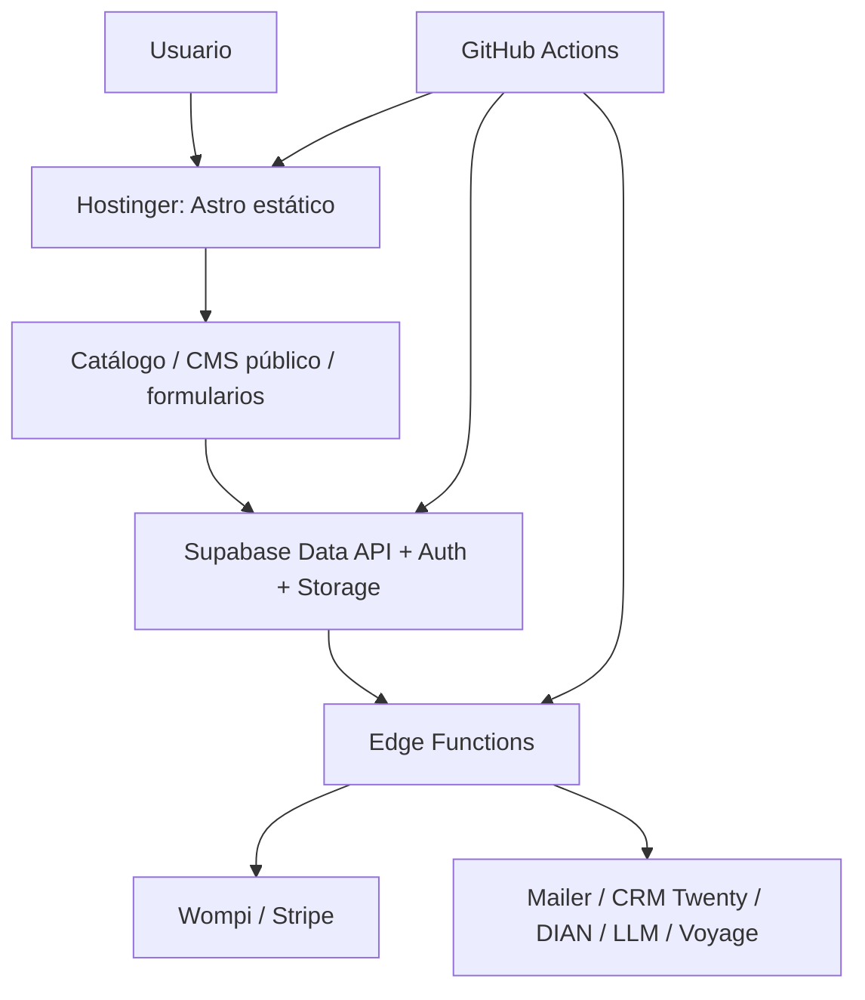

# Arquitectura encontrada

Astro genera HTML estático con rutas ES/EN, producto, familia, fabricante,
ciudad, conocimiento y legal. Escrituras sensibles pasan por Edge Functions con
`service_role`; frontend usa claves públicas. Integraciones externas están
configuradas por variables y no fueron invocadas durante esta auditoría.

Punto crítico: build es estático; datos de CMS/Supabase deben estar disponibles o
la estrategia fallback puede producir contenido no actualizado.
